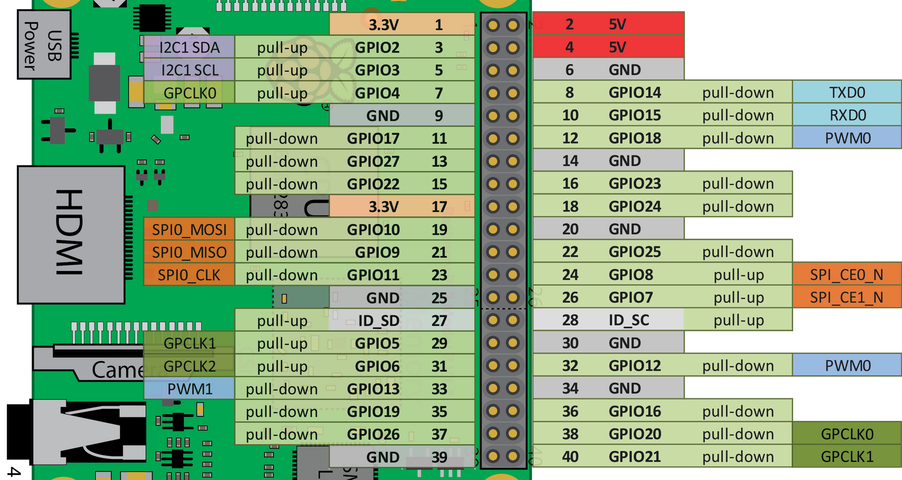

# Бот на Raspberry pi для уведомлений об открытой двери в Телеграмм беседу

## Принцип работы:

К Малинке присоединен гиркон (датчик положения двери), один вывод которого заземлен (6 номер GND), втоорой подан на вход (в коде это GPIO4). На вход сделана подтяжка к питанию. В цепь также впаян резистор на 220 Ом.

---

Сам бот написан на Python (door_notify.py). Для работы бота необходим его TOKEN и id чата в который будет писать бот. 

В начале работы инициализируются работа с портами и телеграмм бот.
После чего определяется текущее время.
- В бесконичном цикле отпрашивается гиркон с частотой 1 раз в секунду.
    - При первом открытии двери в день бот отправляет соответсввующее уведомление в беседу.
        - При этом перед отправкой запускается дополнительная проверка (придет ли сегодня аванс или зарплата), в резлуьтате кторой отправляемое сообщение может поменятся.
    - Если дверь сегодня уже открывалась, то программа засыпает на 30 мин. 
    - При пробуждении проверяется не начался ли следующий день
        - В пятницу при пробуждении после определенного времени отправляется пятничное уведомление.

---

Последоватльеность действий для настройки работы программы описана в файле setup.txt
